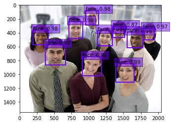

# darkroom

Docker container to train Single Shot Multibox Detector (SSD) to detect faces using the Face Scrub dataset. 

More about Single Shot Detector: [Paper](http://arxiv.org/abs/1512.02325)
[Slides](http://www.cs.unc.edu/~wliu/papers/ssd_eccv2016_slide.pdf)
[Repo](https://github.com/weiliu89/caffe/tree/ssd)

More about Face Scrub dataset: [Site](http://www.vintage.winklerbros.net/facescrub.html)



## No GPU? Just want to play with models?

You can test out two models I trained on the Face Scrub data set in the ssd_cpu [folder](https://github.com/dave-lab41/darkroom/ssd_cpu)

## Instructions for Training A Model

Note: The Docker file contained below requires nvidia-docker and GPU resources enabled for CUDA. Training SSD to detect faces required approximately 3 days while running on 3 Nvidia Titan X GPUs in parallel. It will not work on CPUs. 

### 1. Obtain Face Scrub data files

Complete the [form](http://form.jotform.me/form/43268445913460) found on the Face Scrub [site](http://www.vintage.winklerbros.net/facescrub.html) to get access to the Face Scrub data files

### 2. Obtain VGGNet model and the VOC2007/VOC2012 datasets

Follow steps 1 and 2 in the Preparation section of the SSD repository [site](https://github.com/weiliu89/caffe/tree/ssd) as outlined below:

1. Download [fully convolutional reduced (atrous) VGGNet](https://gist.github.com/weiliu89/2ed6e13bfd5b57cf81d6). Save the model on your computer inside a folder structure `models/VGGNet/`

2. Download VOC2007 and VOC2012 dataset. Save the results in a folder on your computer named `VOCdata/`
  ```Shell
  # Download the data.
  cd $HOME/data
  wget http://host.robots.ox.ac.uk/pascal/VOC/voc2012/VOCtrainval_11-May-2012.tar
  wget http://host.robots.ox.ac.uk/pascal/VOC/voc2007/VOCtrainval_06-Nov-2007.tar
  wget http://host.robots.ox.ac.uk/pascal/VOC/voc2007/VOCtest_06-Nov-2007.tar
  # Extract the data.
  tar -xvf VOCtrainval_11-May-2012.tar
  tar -xvf VOCtrainval_06-Nov-2007.tar
  tar -xvf VOCtest_06-Nov-2007.tar
  ```

### 3. Git Clone the darkroom Repository to your Computer

You probably already know how to do this.

```git clone https://github.com/dave-lab41/darkroom.git```

### 4. Install opencv and numpy dependencies to process Face Scrub data files

OpenCV can be frustrating to install. My preferred method is to install [Miniconda](https://conda.io/miniconda.html) and run

```Shell
conda install -c menpo opencv3
conda install numpy
```

### 5. Download and Process Images from the Face Scrub files 

Create a directory (example: fscrub) on your computer and place the Face Scrub actor and actress files inside the directory.

Navigate to the darkroom directory, view preprocess_facescrub.py and update the facescrub_folder variable on line 14 to the folder where you placed the Face Scrub actor and actress files.

Now run  

```Shell
python preprocess_facescrub.py
``` 
You will need at least 9000 Face Scrub images to insert into the VOC dataset. This process can take an hour or longer, depending on network speed and the number of broken links in the Face Scrub data files. Ensure that at least 9000 files exist in the JPEGImages and Annotations folders by running this command in another terminal

```Shell
ls -l /fscrub/JPEGImages/ | wc -1
```

Note: preprocess_facescrub.py creates pairs of files in JPEGImages and Annotations. If only one file of the pair exists, SSD training will fail. You can ensure that there are no orphan files by running

```Shell
ls JPEGImages/ | sed 's/.jpg/''/g' > jpeg.txt
ls Annotations/ | sed 's/.xml/''/g' > xml.txt
diff jpeg.txt xml.txt 
```

### 6. Merge Facescrub Images into VOC dataset

View merge_facescrub.py and update the VOC_folder and facescrub_folder variables on line 9 and 11 to match the directories you chose. 

Now run 
```Shell
python merge_facescrub.py
```

Note: If merge_facescrub.py fails because you don't have enough face images, run

```Shell
rm -rf VOCdevkit/VOC2007
rm -rf VOCdevkit/VOC2012
tar -xvf VOCtrainval_11-May-2012.tar
tar -xvf VOCtrainval_06-Nov-2007.tar
tar -xvf VOCtest_06-Nov-2007.tar
```

You can run preprocess_facescrub.py again to download more Face Scrub images and then run merge_facescrub.py again


### 7. Build the darkroom Docker container

At this point you have replaced the "people" class in the original VOC data with a "face" class. The "face" class has been populated throughout the VOC data with the Face Scrub images you downloaded.

It's time to train SSD so build the container by running

```Shell
docker build -f Dockerfile.retrain_ssd_gpu -t darkroom.retrain_ssd_gpu .
```

Note: create_lmdb.sh in the darkroom repository is configured to start a jupyter notebook session for you to kick off training from a terminal inside jupyter. If you prefer to execute training directly, comment out the Jupyter execution statement in create_lmdb.sh and uncomment the python script execution line in create_lmdb.sh before building the Docker container.

### 8. Run the container

It's go time. Run

```Shell
nvidia-docker run -v /path/to/VOGGmodel/:/opt/caffe/models/VGGNet -v /path/to/VOCdata/:/root/data -p 8888:8888 darkroom.retrain_ssd_gpu
```
We are mounting two volumes into the Docker container. The first is the VGG model you downloaded and the second is the VOC data with the inserted Face Scrub images 

VOC file processing will occur automatically and a jupyter link will be presented at the end

### 9. Start training

Open the jupyter link presented to open a jupyter browser session. In the upper right corner click the 'new' button to start a new terminal. Run

```Shell
python examples/ssd/ssd_pascal.py
```

Note: The command 'python examples/ssd/ssd_pascal.py' is configured to begin training on an input size of 300x300 pixels. The file 'examples/ssd/ssd_pascal_xxx.py' in the container is configured to train on an input size of 450x450 pixels. I was unable to train on input sizes larger than 450x450 due to GPU memory limitations and associated execution failures. 

### 10. Review the results

When 120,000 iterations of training ends after a few days, an detection evaluation metric will be presented. In my experiments the scores were 0.77 (300x300 pixels) and 0.79 (450x450 pixels). The SSD [repository](https://github.com/weiliu89/caffe/tree/ssd) lists very similar detection evaluation scores. 

You can also evaluate your model with the jupyter notebook 'examples/ssd/ssd_detect.ipynb' inside the container.

First use a jupyter terminal to wget images from the internet that you would like to test for face detection. Alternatively, place images on your local computer in one of the local volumes mounted to the Docker container so the images can be accessed from inside the container

Then set the model_weights variable in cell 2 of 'examples/ssd/ssd_detect.ipynb' to the location of your model, such as

```Shell 
model_weights = '/opt/caffe/models/VGGNet/VOC0712/SSD_300x300/VGG_VOC0712_SSD_300x300_iter_120000.caffemodel'
```

Execute the cells and the notebook will draw bounding boxes around objects detected by your model, including faces

Note: If you executed 'examples/ssd/ssd_pascal_xxx.py' you need to change the 'image_resize' variable in cell 3 to the size of your input. Be sure to assign the new 'model_def' and 'model_weights' variables in cell 2 correctly as well.


