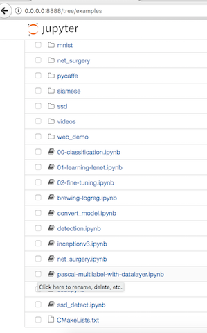
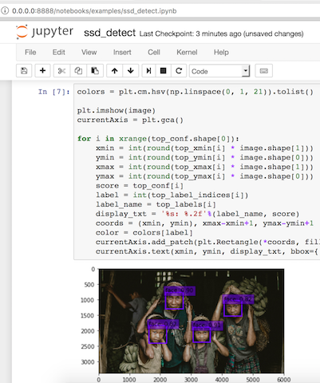

# *Single Shot Detector (SSD) container for CPU*

More about Single Shot Detector: [Paper](http://arxiv.org/abs/1512.02325)
[Slides](http://www.cs.unc.edu/~wliu/papers/ssd_eccv2016_slide.pdf)
[Repo](https://github.com/weiliu89/caffe/tree/ssd)

## Object detector

### 1. get a pretrained model

1. Download a Caffe model with a 300x300 pixel input that was trained on the Face Scrub dataset [here](https://drive.google.com/file/d/0B5YNnW8pHPSWZDBhdWFIVHZMWVE/view?usp=sharing). 
In this example the tar file will be saved to the ~/models directory

2. Untar the file at the terminal by running
```Shell
tar -xvf SSD300x300.tar
```

### 2. build docker container

At the terminal run the command
```Shell
docker build -f Dockerfile.ssd_cpu -t darkroom.ssd_cpu .
```

### 3. run the container

```Shell
docker run -v ~/models:/opt/caffe/models/SSD/ -p 8888:8888 darkroom.ssd_cpu
```

### 4. try out the ssd_detect notebook with the pretrained 300x300 model

1. Open jupyter in your browser via the link provided in the docker container output.  

2. Navigate to the 'examples' folder inside the jupyter web interface and open ssd_detect.ipynb 



3. When the notebook loads, execute the notebook cells in order by pressing the play button or Shift+Enter




## (Optional) Testing other Images and other Models

### download other images

1. From the home screen of the jupyter web interface, find the 'new' button on the right and use it to open a terminal

2. Navigate to the examples/images folder

```Shell
cd examples/images/
```

3. Use wget to download images into the container from the internet. 

```Shell
wget [url]
```

If you have images stored locally, you can add execute docker run from step 3 above with another local volume mount (ex: -v /localfolder/with/images:/opt/caffe/models/examples/images/test/)

4. Update cell 4 in the ssd_detect notebook with the name of the file you downloaded. 

```Shell
example = 'examples/images/[downloadedFile].jpg'
```
Update the folder path if you mounted another local volume (ex: 'examples/images/test/[downloadedFile].jpg')

### get a different pretrained model

Expanding the input pixel size improves face detection results and you can compare results with a 450x450 model 

1. Download a 450x450 pixel Caffe model that was trained on the Face Scrub dataset [here](https://drive.google.com/file/d/0B5YNnW8pHPSWRDRwd1pMd0ZVXzA/view?usp=sharing)
In this example the tar file will be saved to the ~/models directory

2. Untar the file at the terminal by running
```Shell
tar -xvf SSD450x450.tar
```

3. Change the first three lines of the ssd_detect.ipynb notebook to the following:

```Shell
model_def = '/opt/caffe/models/SSD/SSD450/deploy.prototxt'
model_weights = '/opt/caffe/models/SSD/SSD450/VGG_VOC0712_SSD_450x450_iter_120000.caffemodel'
image_resize = 450
```

4. Execute the notebook cells in order from the beginning by pressing the play button or Shift+Enter


